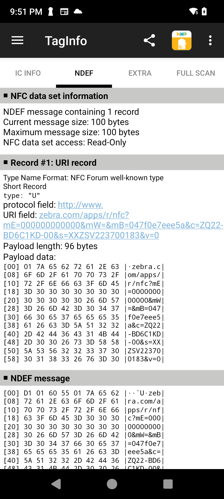
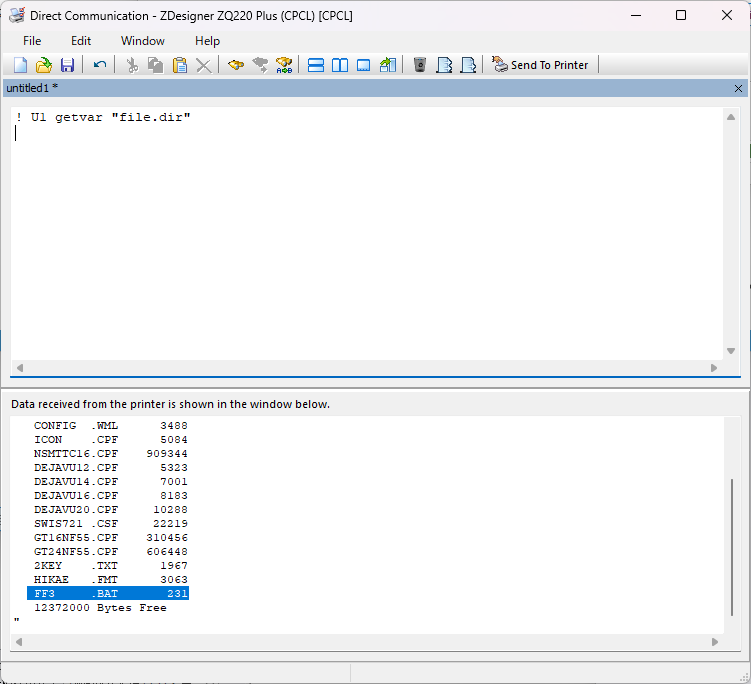

Zebra-Printer_Print Bluetooth MAC Address from Mobile Printer
# Bluetooth MACアドレスをモバイルプリンタから印刷する方法


</br>

ゼブラのモバイルプリンタにはBluetooth MACアドレスのバーコードラベルが貼付されており、ホストとのペアリングで用いられることが多々あります。しかし、クレードルにマウントしたり、ラベルの経年劣化、破損によって、BluetoothのMACアドレスラベルを用いてのペアリングができなくなることがあります。そのような場合にBluetooth MACアドレスを知るための方法をいくつかご紹介します。

</br>


1. NFCタグから情報を収集する
1. FF3.BATを使用してBluetooth MACアドレスを印刷する方法

</br>

---

</br>

## 🖨 NFCタグから情報を収集する


### 🔍 概要

ゼブラプリンタのペアリング用タグにはBluetooth MACアドレス情報が含まれています。スマホ端末などのNFCリーダソフトでNFC情報を取得して確認しましょう。

---

### 🛠 手順

下記例では、Zebra EM45からTaginfoソフトでNFC情報を取得しています。

▼ "mB="以降の12文字がBluetooth MAC Addressとなります。



[参考ソフト：Taginfo](https://play.google.com/store/apps/details?id=com.nxp.taginfolite&hl=ja)

</br>
</br>

## 🖨 FF3.BATを使用してBluetooth MACアドレスを印刷する方法（フィードボタンを3回押す）

### 🔍 概要
この手順では、ZebraプリンタにCPCL形式のBATファイル（FF3.BAT）を保存し、プリンタ起動後にフィードボタンを3回押すことで、Bluetooth MACアドレスを自動印刷する方法を説明しています。

---

### 🛠 手順

1. **FF3.BATファイルをプリンタに送信**

   下記コマンドをプリンタに対して実行します。  

   ※印刷内容はご利用の環境に合わせて、適宜変更してください。

   ```
   ! DF FF3.BAT
   ! 0 200 200 406 1
   TONE 50
   SPEED 5
   PAGE-WIDTH 400
   T 7 0 10 20 Serial No: !<vnd.zo.device.friendly_name>
   T 7 0 10 60 Bluetooth Address:
   CENTER BT 7 0 6 B 128 1 30 75 0 90 !<vnd.zo.bluetooth.short_address>
   BT OFF
   LEFT
   PRINT
   ```
    </br>

1. **FF3.BATの作成を確認する**
    ```
    ! U1 getvar "file.dir"

    表示結果にFF3.BATがあることを確認する。
    ```

    

    </br>


1. **プリンタを再起動し、フィードボタンを3回押す**
   → Bluetooth MACアドレスが印刷されます。

    

    ↓

    

---

### 📎 補足情報

- Zebra Setup Utilitiesを使えば、プリンタへのコマンド送信や設定確認が可能。
